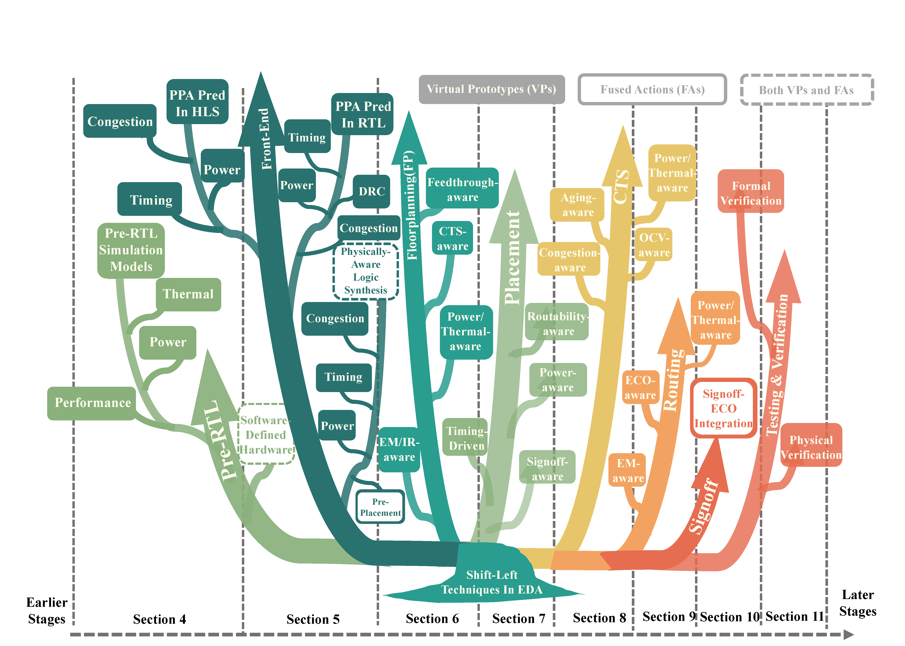
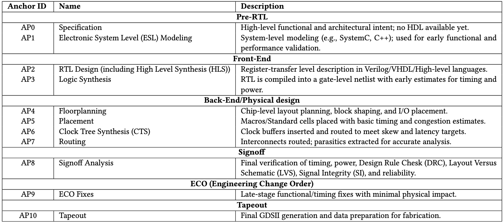

# Shift Left Techniques in Electronic Design Automation: A Survey

👏 Welcome to the official repository for the survey paper [[Archive]()]! 

We designed it to be a living, up-to-date resource that provides a comprehensive overview of the field related to shift-left techniques in electronic design automation. 

We're dedicated to **updating it with the latest research advances** but we believe that keeping this resource current requires community effort, and we warmly **invite your participation**. 

If you find a valuable related paper or resource we've missed, please feel free to **contact us** via email at [xinfei.guo@sjtu.edu.cn](mailto:xinfei.guo@sjtu.edu.cn) or [hu-fan@sjtu.edu.cn](mailto:hu-fan@sjtu.edu.cn) and **submit a pull request** to keep this repository up to date. 

## Introduction
The chip design process involves numerous steps, beginning with defining product requirements and progressing through architectural planning, system-level design, and the physical layout of individual circuit blocks. As the enablers of large-scale chip development, Electronic Design Automation (EDA) tools play a vital role in helping designers achieve high-quality results. The Shift-Left methodology introduces a pathway toward creating digital twins and fusing multiple design steps, thereby transitioning traditionally sequential, physically-aware processes into virtual design environments. This shift allows designers to establish stronger correlations earlier and optimize designs more effectively. However, challenges remain, especially in accurately replicating downstream behaviors and determining the right scope and timing for adoption. These challenges, in turn, have revealed new opportunities for EDA vendors, physical designers, and logic designers alike. As the industry advances toward intelligent EDA tools and techniques, it is timely to reflect on Shift-Left progress made and the challenges that remain. The rise of AI techniques and the momentum of open-source design flows have significantly strengthened prediction and modeling capabilities, making data-driven methods increasingly relevant to the EDA community. This, in turn, enhances the "Shift-Left" features embedded in current tools. In this paper, we present a comprehensive survey of existing and emerging paradigms in Shift-Left research within EDA and the broader design ecosystem. Our goal is to provide a unique perspective on the state of the field and its future directions. 
<!-- 

  

 -->

  <strong>A Taxonomy of Shift-Left Techniques Reviewed in This Paper</strong>

  

In this figure, we present a taxonomy of Shift-Left techniques reviewed in this survey paper. *A **Virtual Prototypes (VPs)*** creates digital twins that predict downstream behaviors, while ***Fused Actions (FAs)** integrate later design stages with earlier steps to accelerate convergence.*

  <strong>Grouped Anchor Points in the EDA Design Flow</strong>

  

To provide a comprehensive overview of EDA design stages in our survey, we establish ***anchor points (AP)*** within the design flow to track and quantify "Shift-Left" movements as shown in the table above. These anchor points represent **key, well-defined stages** in a typical EDA flow, mapping the progression from early design phases to final signoff in a standard digital design workflow.

## Table of Contents

- [Introduction](#-introduction)
- [Shift-Left in Pre-RTL](#shift-left-in-pre-rtl)
    - [Pre-RTL Simulation Models](#pre-rtl-simulation-models)
    - [Software-defined Hardware](#software-defined-hardware)
    - [Workload Modeling](#workload-modeling)
    - [Design Space Exploration (DSE) in Early Design Phases](#design-space-exploration-dse-in-early-design-phases)
- [Shift-Left in Front-End Design Phase](#shift-left-in-front-end-design-phase)
    - [Shift Left Prediction in HLS](#shift-left-prediction-in-hls)
    - [Shift Left Prediction in RTL](#shift-left-prediction-in-rtl)
    - [Physically-Aware Logic Synthesis](#physically-aware-logic-synthesis)
    - [Physically-Aware HLS](#physically-aware-hls)
- [Shift-Left in FloorPlanning (FP)](#shift-left-in-floorplanning-fp)
    - [Feedthrough-aware FP](#feedthrough-aware-fp)
    - [CTS-Aware FP](#cts-aware-fp)
    - [Power/Thermal-Aware FP](#powerthermal-aware-fp)
    - [EM/IR-Aware FP](#emir-aware-fp)
- [Shift-Left in Placement](#shift-left-in-placement)
    - [Timing-Driven Placement](#timing-driven-placement)
    - [Routability-Aware Placement](#routability-aware-placement)
    - [Power-Aware Placement](#power-aware-placement)
    - [Signoff-Aware Placement](#signoff-aware-placement)
- [Shift-Left in CTS](#shift-left-in-cts)
    - [Aging-Aware CTS](#aging-aware-cts)
    - [Congestion-Aware CTS](#congestion-aware-cts)
    - [Thermal/Power-Aware CTS](#thermalpower-aware-cts)
    - [On-Chip Variation (OCV)-Aware CTS](#on-chip-variationocv-aware-cts)
- [Shift-Left in Routing](#shift-left-in-routing)
    - [ECO-Aware Routing](#eco-aware-routing)
    - [EM-Aware Routing](#em-aware-routing)
    - [Power/Thermal-Aware Routing](#powerthermal-aware-routing)
- [Shift-Left in Signoff](#shift-left-in-signoff)
- [Shift-Left for Verification and Testing](#shift-left-for-verification-and-testing)
    - [Formal Verification](#formal-verification)
    - [Physical Verification](#physical-verification)

## Shift-Left in Pre-RTL
### Pre-RTL Simulation Models
- (2011) ACM SIGARCH Computer Architecture News: The gem5 simulator. [[paper](https://dl.acm.org/doi/10.1145/2024716.2024718)] 
- (2011) International Conference for High Performance Computing, Networking, Storage and Analysis (SC): Sniper: Exploring the level of abstraction for scalable and accurate parallel multi-core simulation. [[paper](https://ieeexplore.ieee.org/document/6114398)] 
- (2010) International Symposium on High-Performance Computer Architecture (HPCA): Interval simulation: Raising the level of abstraction in architectural simulation [[paper](https://ieeexplore.ieee.org/document/5416636)] 
- (2013) ACM SIGARCH Computer Architecture News: ZSim: Fast and accurate microarchitectural simulation of thousand-core systems [[paper](https://dl.acm.org/doi/10.1145/2508148.2485963)] [[code](https://github.com/s5z/zsim)] 
- (2011) IEEE Computer Architecture Letters: DRAMSim2: A cycle accurate memory system simulator [[paper](https://ieeexplore.ieee.org/document/5732229)] [[code](https://github.com/umd-memsys/DRAMSim2)] 
- (2020) IEEE Computer Architecture Letters: DRAMsim3: A cycle-accurate, thermal-capable DRAM simulator [[paper](https://ieeexplore.ieee.org/document/8999595)] [[code](https://github.com/umd-memsys/DRAMsim3)] 
- (2019) IEEE International Symposium on Performance Analysis of Systems and Software (ISPASS): Timeloop: A systematic approach to dnn accelerator evaluation [[paper](https://ieeexplore.ieee.org/document/8695666)] [[code](https://github.com/NVlabs/timeloop)] 
- (2014) ACM SIGARCH Computer Architecture News: Aladdin: A pre-RTL, power-performance accelerator simulator enabling large design space exploration of customized architectures [[paper](https://ieeexplore.ieee.org/document/6853196)] [[code](https://github.com/harvard-acc/ALADDIN)] 
- (2022) IEEE/ACM International Symposium on Microarchitecture (MICRO): Sparseloop: An analytical approach to sparse tensor accelerator modeling [[paper](https://dl.acm.org/doi/abs/10.1109/MICRO56248.2022.00096)] [[code](https://github.com/Accelergy-Project/micro22-sparseloop-artifact)] 
- (2024) IEEE International Symposium on Performance Analysis of Systems and Software (ISPASS): CiMLoop: A flexible, accurate, and fast compute-in-memory modeling tool [[paper](https://ieeexplore.ieee.org/document/10590023/)] [[code](https://github.com/mit-emze/cimloop)] 
- (2019) IEEE International Electron Devices Meeting (IEDM): DNN+ NeuroSim: An end-to-end benchmarking framework for compute-in-memory accelerators with versatile device technologies [[paper](https://ieeexplore.ieee.org/document/8993491)] [[code](https://github.com/neurosim/DNN_NeuroSim_V1.0)] 
- (2009) ACM/IEEE International Symposium on Microarchitecture (MICRO): McPAT: An integrated power, area, and timing modeling framework for multicore and manycore architectures [[paper](https://ieeexplore.ieee.org/document/5375438)] [[code](https://github.com/HewlettPackard/mcpat)]
- (2017) ACM Transactions on Architecture and Code Optimization (TACO): CACTI 7: New tools for interconnect exploration in innovative off-chip memories [[paper](https://dl.acm.org/doi/10.1145/3085572)]
- (2009) HP Laboratories Technical Report: CACTI 6.0: A tool to model large caches [[paper](https://www.researchgate.net/publication/242516869_Cacti_60_A_tool_to_model_large_caches)]
- (2019) IEEE/ACM International Conference on Computer-Aided Design (ICCAD): Accelergy: An architecture-level energy estimation methodology for accelerator designs [[paper](https://ieeexplore.ieee.org/document/8942149)] [[code](https://github.com/Accelergy-Project/accelergy)]
- (2022) IEEE Intersociety Conference on Thermal and Thermomechanical Phenomena in Electronic Systems (iTherm): From 2.5 D to 3D chiplet systems: Investigation of thermal implications with HotSpot 7.0 [[paper](https://ieeexplore.ieee.org/document/9899649)]
- (2006) IEEE Transactions on Very Large Scale Integration (VLSI) Systems: HotSpot: A compact thermal modeling methodology for early-stage VLSI design [[paper](https://ieeexplore.ieee.org/document/1650228)] [[code](https://github.com/uvahotspot/HotSpot)]
- (2010) IEEE/ACM International Conference on Computer-Aided Design (ICCAD): 3D-ICE: Fast compact transient thermal modeling for 3D ICs with inter-tier liquid cooling [[paper](https://ieeexplore.ieee.org/document/5653749)] [[code](https://esl.epfl.ch/3D-ICE)]
- (2021) IEEE International Symposium on Workload Characterization (IISWC): HotGauge: A methodology for characterizing advanced hotspots in modern and next generation processors [[paper](https://ieeexplore.ieee.org/document/9668287)]
- (2018) IEEE Embedded Systems Letters: HotSniper: Sniper-based toolchain for many-core thermal simulations in open systems [[paper](https://ieeexplore.ieee.org/document/8444047)]
- (2022) ACM Transactions on Architecture and Code Optimization (TACO): CoMeT: An integrated interval thermal simulation toolchain for 2D, 2.5 D, and 3D processor-memory systems [[paper](https://dl.acm.org/doi/10.1145/3532185)]
- (2023) International Green and Sustainable Computing Conference (IGSC): Hot-LEGO: Architect Microfluidic Cooling Equipped 3DIC with Pre-RTL Thermal Simulation [[paper](https://dl.acm.org/doi/10.1145/3634769.3634801)]
- (2025) IEEE Journal on Emerging and Selected Topics in Circuits and Systems: Cool-3D: An End-to-End Thermal-Aware Framework for Early-Phase Design Space Exploration of Microfluidic-Cooled 3DICs [[paper](https://doi.org/10.1109/JETCAS.2025.3590065)]
### Software-defined Hardware
- (2025) Springer SOC-Based Solutions in Emerging Application Domains: Software-Defined SOCs [[paper]()][[code]()]
- (2011) ACM SIGARCH computer architecture news: The gem5 simulator [[paper]()][[code]()]
- (2021) ACM/IEEE Workshop on Machine Learning for CAD (MLCAD): A survey of graph neural networks for electronic design automation [[paper]()][[code]()]
### Workload Modeling
- (2011) ACM SIGARCH computer architecture news The gem5 simulator [[paper]()][[code](https://www.gem5.org/)]
- (2011) International Conference for High Performance Computing, Networking, Storage and Analysis Sniper: Exploring the level of abstraction for scalable and accurate parallel multi-core simulation [[paper]()][[code](https://snipersim.org/w/The-Sniper-Multi-Core-Simulator)]
- (2019) IEEE international symposium on performance analysis of systems and software (ISPASS) Timeloop: A systematic approach to dnn accelerator evaluation [[paper]()][[code](https://github.com/NVlabs/timeloop)]
- (2021) IEEE Transactions on Computers ZigZag: Enlarging joint architecture-mapping design space exploration for DNN accelerators [[paper]()][[code](https://github.com/zigzag-project/zigzag)]

### Design Space Exploration (DSE) in Early Design Phases
- (2005) Asia and South Pacific Design Automation Conference (ASP-DAC)： Thermal-driven multilevel routing for 3-D ICs [[paper]()]
- (2019) IEEE international symposium on performance analysis of systems and software (ISPASS): Timeloop: A systematic approach to dnn accelerator evaluation [[paper]()][[code](https://github.com/NVlabs/timeloop)]
- (2022) IEEE Journal on Emerging and Selected Topics in Circuits and Systems Aero: Design space exploration framework for resource-constrained cnn mapping on tile-based accelerators [[paper]()]
- (2021) IEEE Transactions on Computers: ZigZag: Enlarging joint architecture-mapping design space exploration for DNN accelerators [[paper]()][[code](https://github.com/zigzag-project/zigzag)]

## Shift-Left in Front-End Design Phase
### Shift Left Prediction in HLS
- (2017) IEEE/ACM International Conference on Computer-Aided Design (ICCAD): COMBA: A comprehensive model-based analysis framework for high level synthesis of real applications [[paper](https://ieeexplore.ieee.org/document/8203809)]
- (2013) Euromicro Conference on Digital System Design: A fast and autonomous HLS methodology for hardware accelerator generation under resource constraints [[paper](https://ieeexplore.ieee.org/document/6628278)]
- (2012) Design, Automation & Test in Europe Conference & Exhibition (DATE): Compositional system-level design exploration with planning of high-level synthesis [[paper](https://ieeexplore.ieee.org/document/6176550)]
- (2014) IEEE International Conference on Computer Design (ICCD): Design space exploration of multiple loops on FPGAs using high level synthesis [[paper](https://ieeexplore.ieee.org/document/6974719/)]
- (2017) Annual Design Automation Conference (ADAC): FlexCL: An analytical performance model for OpenCL workloads on flexible FPGAs [[paper](https://ieeexplore.ieee.org/document/8060311)]
- (2016) IEEE International Symposium on High Performance Computer Architecture (HPCA): A performance analysis framework for optimizing OpenCL applications on FPGAs [[paper](https://ieeexplore.ieee.org/document/7446058)]
- (2009) Communications of the ACM: Roofline: an insightful visual performance model for multicore architectures [[paper](https://dl.acm.org/doi/10.1145/1498765.1498785)]
- (2013) International Journal of Reconfigurable Computing: Performance Modeling for FPGAs: Extending the Roofline Model with High-Level Synthesis Tools [[paper](https://onlinelibrary.wiley.com/doi/full/10.1155/2013/428078)]
- (2021) Great Lakes Symposium on VLSI (GLSVLSI): Ironman: Gnn-assisted design space exploration in high-level synthesis via reinforcement learning [[paper](https://dl.acm.org/doi/abs/10.1145/3453688.3461495)]
- (2022) ACM/IEEE Design Automation Conference (DAC): High-level synthesis performance prediction using GNNs: benchmarking, modeling, and advancing [[paper](https://dl.acm.org/doi/10.1145/3489517.3530408)]
- (2017) Design, Automation & Test in Europe Conference & Exhibition (DATE): Design space exploration of FPGA-based accelerators with multi-level parallelism [[paper](https://ieeexplore.ieee.org/document/7927161)]
- (2016) International Conference on Field Programmable Logic and Applications (FPL): Efficient and reliable high-level synthesis design space explorer for FPGAs [[paper](https://ieeexplore.ieee.org/document/7577370)]
- (2013) Annual Design Automation Conference: On learning-based methods for design-space exploration with high-level synthesis [[paper](https://ieeexplore.ieee.org/document/6560643)]
- (2018) IEEE Annual International Symposium on Field-Programmable Custom Computing Machines (FCCM): Fast and accurate estimation of quality of results in high-level synthesis with machine learning [[paper](https://ieeexplore.ieee.org/document/8457644)]
- (2018) International Conference on Computer-Aided Design (ICCAD): HLSPredict: Cross platform performance prediction for FPGA high-level synthesis [[paper](https://ieeexplore.ieee.org/document/8587690)]
- (2019) Asia and South Pacific Design Automation Conference (ASP-DAC): Xppe: cross-platform performance estimation of hardware accelerators using machine learning [[paper](https://dl.acm.org/doi/10.1145/3287624.3288756)]
- (2016) ACM/IEEE 43rd Annual International Symposium on Computer Architecture (ISCA): Automatic generation of efficient accelerators for reconfigurable hardware [[paper](https://ieeexplore.ieee.org/document/7551387)]
- (2006) IEEE Transactions on Computer-Aided Design of Integrated Circuits and Systems (TCAD): Design space pruning through early estimations of area/delay tradeoffs for FPGA implementations [[paper](https://ieeexplore.ieee.org/document/1677683)]
- (2015) Design, Automation & Test in Europe Conference & Exhibition (DATE): Exploiting loop-array dependencies to accelerate the design space exploration with high level synthesis [[paper](https://ieeexplore.ieee.org/document/7092375/)]
- (2017) IEEE/ACM International Conference on Computer-Aided Design (ICCAD): HLScope+: Fast and accurate performance estimation for FPGA HLS [[paper](https://dl.acm.org/doi/10.1109/ICCAD.2017.8203844)]
- (2016) Annual Design Automation Conference (DAC): Lin-analyzer: A high-level performance analysis tool for FPGA-based accelerators [[paper](https://dl.acm.org/doi/10.1145/2897937.2898040)]
- (2019) International Conference on Field Programmable Logic and Applications (FPL): Pyramid: Machine learning framework to estimate the optimal timing and resource usage of a high-level synthesis design [[paper](https://ieeexplore.ieee.org/abstract/document/8892009)]
- (2020) International Conference on Computer-Aided Design (ICCAD): Accurate operation delay prediction for FPGA HLS using graph neural networks [[paper](https://dl.acm.org/doi/abs/10.1145/3400302.3415657)]
- (2020) Asia and South Pacific Design Automation Conference (ASP-DAC): HL-Pow: A learning-based power modeling framework for high-level synthesis [[paper](https://ieeexplore.ieee.org/abstract/document/9045442)]
- (2015) Design, Automation & Test in Europe Conference & Exhibition (DATE): Dynamic power and performance back-annotation for fast and accurate functional hardware simulation [[paper](https://ieeexplore.ieee.org/abstract/document/7092557)]
- (2012) ACM International Symposium on Physical Design (ISPD): Towards layout-friendly high-level synthesis [[paper](https://dl.acm.org/doi/abs/10.1145/2160916.2160952)]
- (2018) International Conference on IC Design & Technology (ICICDT): Wire congestion aware high level synthesis flow with source code compiler [[paper](https://ieeexplore.ieee.org/abstract/document/8399766)]
- (2019) Design, Automation & Test in Europe Conference & Exhibition (DATE): Machine learning based routing congestion prediction in FPGA high-level synthesis [[paper](https://ieeexplore.ieee.org/abstract/document/8714724)]
- (2021) IEEE Access: High-level annotation of routing congestion for Xilinx Vivado HLS designs [[paper](https://ieeexplore.ieee.org/abstract/document/9381853)]
### Shift Left Prediction in RTL
- (2023) IEEE/ACM International Conference on Computer Aided Design (ICCAD): MasterRTL: A Pre-Synthesis PPA Estimation Framework for Any RTL Design [[paper](https://ieeexplore.ieee.org/abstract/document/10323951)]
- (2025) IEEE Transactions on Computer-Aided Design of Integrated Circuits and Systems (TCAD): Transferable Presynthesis PPA Estimation for RTL Designs With Data Augmentation Techniques [[paper](https://ieeexplore.ieee.org/abstract/document/10577671)]
- (2022) Annual International Symposium on Computer Architecture (ISCA): SNS’s not a synthesizer: a deep-learning-based synthesis predictor [[paper](https://dl.acm.org/doi/abs/10.1145/3470496.3527444)]
- (2019) Annual Design Automation Conference (DAC): A Learning-Based Recommender System for Autotuning Design Flows of Industrial High-Performance Processors [[paper](https://dl.acm.org/doi/abs/10.1145/3316781.3323919)]
- (2020) Asia and South Pacific Design Automation Conference (ASP-DAC): FIST: A Feature-Importance Sampling and Tree-Based Method for Automatic Design Flow Parameter Tuning [[paper](https://ieeexplore.ieee.org/abstract/document/9045201)]
- (2021) IEEE/ACM International Conference On Computer Aided Design (ICCAD): Fast and Accurate PPA Modeling with Transfer Learning [[paper](https://ieeexplore.ieee.org/abstract/document/9643533)]
- (2023) ACM/IEEE Workshop on Machine Learning for CAD (MLCAD): ASAP: Accurate Synthesis Analysis and Prediction with Multi-Task Learning [[paper](https://ieeexplore.ieee.org/abstract/document/10299840)]
- (2023) Synopsys, Inc. Technical Report: Achieving Consistent RTL Power Accuracy [[link](https://www.synopsys.com/energy-efficient/achieving-consistent-rtl-power-accuracy.html)]
- (2025) arXiv: CircuitFusion: Multimodal Circuit Representation Learning for Agile Chip Design [[paper](https://arxiv.org/abs/2505.02168)]
- (2025) arXiv: The Graph’s Apprentice: Teaching an LLM Low Level Knowledge for Circuit Quality Estimation [[paper](https://arxiv.org/abs/2411.00843)]
- (2025) IEEE/ACM International Conference on Computer-Aided Design (ICCAD): RTLRewriter: Methodologies for Large Models aided RTL Code Optimization [[paper](https://dl.acm.org/doi/abs/10.1145/3676536.3676775)]
- (2018) Annual Design Automation Conference (DAC): Developing synthesis flows without human knowledge [[paper](https://dl.acm.org/doi/abs/10.1145/3195970.3196026)]
- (2020) ACM/IEEE Workshop on Machine Learning for CAD (MLCAD): Decision Making in Synthesis cross Technologies using LSTMs and Transfer Learning [[paper](https://dl.acm.org/doi/abs/10.1145/3380446.3430638)]
- (2021) Asia and South Pacific Design Automation Conference (ASP-DAC): Read your Circuit: Leveraging Word Embedding to Guide Logic Optimization [[paper](https://dl.acm.org/doi/abs/10.1145/3394885.3431560)]
- (2022) IEEE/ACM International Conference on Computer-Aided Design (ICCAD): Applying GNNs to Timing Estimation at RTL [[paper](https://dl.acm.org/doi/abs/10.1145/3508352.3561095)]
- (2023) ACM/IEEE Workshop on Machine Learning for CAD (MLCAD): Using Graph Neural Networks for Timing Estimations of RTL Intermediate Representations [[paper](https://ieeexplore.ieee.org/abstract/document/10299859)]
- (2024) Asia and South Pacific Design Automation Conference (ASP-DAC): LSTP: A Logic Synthesis Timing Predictor [[paper](https://ieeexplore.ieee.org/abstract/document/10473925)]
- (2022) IEEE/ACM International Conference on Computer-Aided Design (ICCAD): How Good Is Your Verilog RTL Code? A Quick Answer from Machine Learning [[paper](https://dl.acm.org/doi/abs/10.1145/3508352.3549375)]
- (2023) ACM/IEEE Workshop on Machine Learning for CAD (MLCAD): Early Identification of Timing Critical RTL Components using ML based Path Delay Prediction [[paper](https://ieeexplore.ieee.org/abstract/document/10299879)]
- (2021) IEEE Nordic Circuits and Systems Conference (NorCAS): RTL Delay Prediction Using Neural Networks [[paper](https://ieeexplore.ieee.org/abstract/document/9599868)]
- (2025) International Conference on Machine Learning (ICML): Bridging Layout and RTL: Knowledge Distillation based Timing Prediction [[paper](https://openreview.net/forum?id=pWs925fKyK)]
- (2024) ACM/IEEE Design Automation Conference (DAC): Annotating Slack Directly on Your Verilog: Fine-Grained RTL Timing Evaluation for Early Optimization [[paper](https://dl.acm.org/doi/abs/10.1145/3649329.3655671)]
- (2020) ACM/IEEE Design Automation Conference (DAC): GRANNITE: Graph Neural Network Inference for Transferable Power Estimation [[paper](https://ieeexplore.ieee.org/abstract/document/9218643)]
- (2023) IEEE International Symposium on Circuits and Systems (ISCAS): GRASPE: Accurate Post-Synthesis Power Estimation from RTL using Graph Representation Learning [[paper](https://ieeexplore.ieee.org/abstract/document/10181823)]
- (2021) IEEE/ACM International Symposium on Microarchitecture (MICRO): APOLLO: An Automated Power Modeling Framework for Runtime Power Introspection in High-Volume Commercial Microprocessors [[paper](https://dl.acm.org/doi/abs/10.1145/3466752.3480064)]
- (2019) Annual Design Automation Conference (DAC): PRIMAL: Power Inference using Machine Learning [[paper](https://dl.acm.org/doi/abs/10.1145/3316781.3317884)]
- (2019) IEEE/ACM International Symposium on Microarchitecture (MICRO): Simmani: Runtime Power Modeling for Arbitrary RTL with Automatic Signal Selection [[paper](https://dl.acm.org/doi/abs/10.1145/3352460.3358322)]
- (2015) Asia and South Pacific Design Automation Conference: Early stage real-time SoC power estimation using RTL instrumentation [[paper](https://ieeexplore.ieee.org/abstract/document/7059105)]
- (2022) Ansys, Inc. Product Brief: Ansys PowerArtist
- (2023) ennocad Press Release: EnFortius® RPA empowers flagship AI chip design companies to achieve early power analysis
- (2023) Synopsys, Inc. Technical Report: Achieving Consistent RTL Power Analysis Accuracy
- (2022) International Conference on Neural Information Processing Systems (NIPS): Versatile multi-stage graph neural network for circuit representation [[paper](https://proceedings.neurips.cc/paper_files/paper/2022/hash/7fa548155f40c014372146be387c4f6a-Abstract-Conference.html)]
- (2019) IFIP/IEEE International Conference on Very Large Scale Integration (VLSI-SoC): CongestionNet: Routing Congestion Prediction Using Deep Graph Neural Networks [[paper](https://ieeexplore.ieee.org/abstract/document/8920342)]
- (2021) IEEE/ACM International Conference On Computer Aided Design (ICCAD): Generalizable Cross-Graph Embedding for GNN-based Congestion Prediction [[paper](https://ieeexplore.ieee.org/abstract/document/9643446)]
- (2022) IEEE Transactions on Computer-Aided Design of Integrated Circuits and Systems (TCAD): Preplacement Net Length and Timing Estimation by Customized Graph Neural Network [[paper](https://ieeexplore.ieee.org/abstract/document/9707500)]
- (2025) arXiv: VeriLoC: Line-of-Code Level Prediction of Hardware Design Quality from Verilog Code [[paper](https://arxiv.org/abs/2506.07239)]

### Physically-Aware Logic Synthesis
- (1995) IEEE Transactions on Computer-Aided Design of Integrated Circuits and Systems (TCAD): Combining technology mapping and placement for delay-minimization in FPGA designs [[paper](https://ieeexplore.ieee.org/abstract/document/406709)]
- (2001) IEEE/ACM International Conference on Computer Aided Design (ICCAD): Addressing the timing closure problem by integrating logic optimization and placement [[paper](https://ieeexplore.ieee.org/abstract/document/968622)]
- (1998) IEEE/ACM International Conference on Computer-Aided Design (ICCAD): Wireplanning in logic synthesis [[paper](https://dl.acm.org/doi/pdf/10.1145/288548.288556)]
- (1999) IEEE/ACM International Conference on Computer-Aided Design (ICCAD): An integrated algorithm for combined placement and libraryless technology mapping [[paper](https://ieeexplore.ieee.org/abstract/document/810630)]
- (2008) IEEE/ACM International Conference on Computer-Aided Design (ICCAD): Delay-optimal simultaneous technology mapping and placement with applications to timing optimization [[paper](https://ieeexplore.ieee.org/abstract/document/4681558)]
- (2011) IEEE Transactions on Computer-Aided Design of Integrated Circuits and Systems (TCAD): Simultaneous Technology Mapping and Placement for Delay Minimization [[paper](https://ieeexplore.ieee.org/abstract/document/5715609)]
- (1991) IEEE International Conference on Computer-Aided Design (ICCAD): Layout driven logic restructuring/decomposition [[paper](https://www.researchgate.net/profile/Narasimha-Bhat/publication/3508153_Layout_driven_logic_restructuringdecomposition/links/56f0b74b08ae0dcdafd6b0fa/Layout-driven-logic-restructuring-decomposition.pdf)]
- (1991) ACM/IEEE Design Automation Conference (DAC): Layout driven technology mapping [[paper](https://dl.acm.org/doi/pdf/10.1145/127601.127635)]
- (1998) Annual Design Automation Conference (DAC): A DSM design flow: putting floorplanning, technology-mapping, and gate-placement together [[paper](https://dl.acm.org/doi/abs/10.1145/277044.277072)]
- (2007) Proceedings of the IEEE: Techniques for Fast Physical Synthesis [[paper](https://ieeexplore.ieee.org/abstract/document/4167765)]
- (1998) International Conference on Computer Design (ICCD): Combining technology mapping with post-placement resynthesis for performance optimization [[paper](https://ieeexplore.ieee.org/abstract/document/727128)]
- (2018) Springer International Publishing: Physical Awareness Starting at Technology-Independent Logic Synthesis [[paper](https://link.springer.com/chapter/10.1007/978-3-319-67295-3_4)]
- (2023) IEEE International Conference on Computer Design (ICCD): Delay-driven physically-aware logic synthesis with informed search [[paper](https://ieeexplore.ieee.org/abstract/document/10360970)]
- (2025) Asia and South Pacific Design Automation Conference (ASP-DAC): Revisit MBFF: Efficient Early-Stage Multi-bit Flip-Flops Clustering with Physical and Timing Awareness [[paper](https://dl.acm.org/doi/abs/10.1145/3658617.3697725)]
- (2004) IEEE/ACM International Conference on Computer Aided Design (ICCAD): A new incremental placement algorithm and its application to congestion-aware divisor extraction [[paper](https://ieeexplore.ieee.org/abstract/document/1382637)]
- (2001) IEEE/ACM International Conference on Computer Aided Design (ICCAD): Congestion aware layout driven logic synthesis [[paper](https://ieeexplore.ieee.org/abstract/document/968621)]
- (2002) Design, Automation and Test in Europe Conference and Exhibition (DATE): Layout driven decomposition with congestion consideration [[paper](https://ieeexplore.ieee.org/abstract/document/998371)]
- (2016) International Journal of Hybrid Information Technology: A Study of Floorplanning Challenges and Analysis of macro placement approaches in Physical Aware Synthesis [[paper](https://gvpress.com/journals/IJHIT/vol9_no1/24.pdf)]
- (1993) IEEE International ASIC Conference and Exhibit: Placement and placement driven technology mapping for FPGA synthesis [[paper](https://ieeexplore.ieee.org/abstract/document/410815)]
- (2003) ACM/SIGDA International Symposium on Field Programmable Gate Arrays (FPGA): Placement-driven technology mapping for LUT-based FPGAs [[paper](https://dl.acm.org/doi/abs/10.1145/611817.611836)]
- (2002) Design, Automation and Test in Europe Conference and Exhibition (DATE): Congestion-aware logic synthesis [[paper](https://ieeexplore.ieee.org/abstract/document/998370)]
- (2003) IEEE Transactions on Computer-Aided Design of Integrated Circuits and Systems (TCAD): Global and local congestion optimization in technology mapping [[paper](https://ieeexplore.ieee.org/abstract/document/1190987)]
- (2024) ACM/IEEE Design Automation Conference (DAC): Lesyn: Placement-aware Logic Resynthesis for Non-Integer Multiple-Cell-Height Designs [[paper](https://dl.acm.org/doi/abs/10.1145/3649329.3656243)]
- (2016) Design, Automation & Test in Europe Conference & Exhibition (DATE): A synthesis-parameter tuning system for autonomous design-space exploration [[paper](https://ieeexplore.ieee.org/abstract/document/7459483)]
- (2018) International Journal of Engineering & Technology: Optimization of physically-aware synthesis for digital implementation flow [[paper](https://d1wqtxts1xzle7.cloudfront.net/90903504/4117-libre.pdf?1662905706=&response-content-disposition=inline%3B+filename%3DOptimization_of_Physically_Aware_Synthes.pdf&Expires=1757856142&Signature=GorMZ09yESniNijOl-PbSbVz7sPTdqINduIOt2FLFIJ1xwWXcmfTmQFBKNuOCExRWuB0E7xSTCbeXnOK0uEx9WFpnjugDMiTPOvIXG6qxWvgMaBVs7JOMyZ7n1T5vGWphvtvkBQ5lbtQQ08cipW49-BAqGMBjvfMWhfwXn7yF~JqHLhOJZpaCXVVBVnambLTAm7fHgDcqO-wRy7cqfhz2IoxhvXBdmzkoTVzhEiiQTjZ72kVbEWNnBFqbU3wBTWW-zg~gK22rrf733KH9pHMGJyGT1-AEEnUawIV~dP3BveFW~wQUhXENRknf4HjLd7EjYHr1lgGgYbzfCzhS6ma7w__&Key-Pair-Id=APKAJLOHF5GGSLRBV4ZA)]
- (2025) IEEE/ACM International Conference on Computer-Aided Design (ICCAD): Physically Aware Synthesis Revisited: Guiding Technology Mapping with Primitive Logic Gate Placement [[paper](https://dl.acm.org/doi/abs/10.1145/3676536.3676676)]
- (2024) IEEE Transactions on Computer-Aided Design of Integrated Circuits and Systems (TCAD): PowerSyn: A Logic Synthesis Framework With Early Power Optimization [[paper](https://ieeexplore.ieee.org/abstract/document/10186351)]
- (2024) Conference of Science and Technology for Integrated Circuits (CSTIC): Integration of Shift-Left Updates into Logic Synthesis and Macro Placement [[paper](https://ieeexplore.ieee.org/abstract/document/10531906)]
### Physically-Aware HLS
- (1991) ACM/IEEE Design Automation Conference (DAC): 3D scheduling: high-level synthesis with floorplanning [[paper](https://dl.acm.org/doi/pdf/10.1145/127601.127748)]
- (2002) IEEE/ACM International Conference on Computer Aided Design (ICCAD): Layout-driven resource sharing in high-level synthesis [[paper](https://dl.acm.org/doi/abs/10.1145/774572.774663)]
- (2024) ACM/IEEE Design Automation Conference (DAC): A High Level Approach to Co-Designing 3D ICs [[paper](https://dl.acm.org/doi/abs/10.1145/3649329.3658268)]
- (2014) ACM/SIGDA International Symposium on Field-Programmable Gate Arrays (FPGA): Fast and effective placement and routing directed high-level synthesis for FPGAs [[paper](https://dl.acm.org/doi/abs/10.1145/2554688.2554775)]
- (2020) ACM/IEEE Design Automation Conference (DAC): Analysis and Optimization of the Implicit Broadcasts in FPGA HLS to Improve Maximum Frequency [[paper](https://ieeexplore.ieee.org/abstract/document/9218718)]
- (2015) IEEE International Conference on ASIC (ASICON): Clock skew estimate modeling for FPGA high-level synthesis and its application [[paper](https://ieeexplore.ieee.org/abstract/document/7516905)]
- (2003) International Conference on ASIC: Reallocation and Rescheduling after floor-planning for timing optimization [[paper](https://ieeexplore.ieee.org/abstract/document/5733713)]
- (2015) Annual Design Automation Conference (DAC): Physically aware high level synthesis design flow [[paper](https://dl.acm.org/doi/abs/10.1145/2744769.2744893)]
- (2008) IEEE Pacific-Asia Workshop on Computational Intelligence and Industrial Application: Congestion Aware High Level Synthesis Combined with Floorplanning [[paper](https://ieeexplore.ieee.org/abstract/document/4756913)]
- (2000) Annual Design Automation Conference (DAC): Unifying behavioral synthesis and physical design [[paper](https://dl.acm.org/doi/abs/10.1145/337292.337769)]
- (2006) IEEE Computer Society Annual Symposium on Emerging VLSI Technologies and Architectures (ISVLSI): A Novel Approach to Performance-Oriented Datapath Allocation and Floorplanning [[paper](https://ieeexplore.ieee.org/abstract/document/1602459)]
- (2015) ACM/SIGDA International Symposium on Field-Programmable Gate Arrays (FPGA): Mapping-Aware Constrained Scheduling for LUT-Based FPGAs [[paper](https://dl.acm.org/doi/abs/10.1145/2684746.2689063)]
- (1998) IEEE/ACM International Conference on Computer-Aided Design (ICCAD): Integrating floorplanning in data-transfer based high-level synthesis [[paper](https://dl.acm.org/doi/pdf/10.1145/288548.289063)]
- (2015) Annual Design Automation Conference (DAC): Area-efficient pipelining for FPGA-targeted high-level synthesis [[paper](https://dl.acm.org/doi/abs/10.1145/2744769.2744801)]

## Shift-Left in FloorPlanning (FP)
### Feedthrough-aware  FP
- (2025) Association for Computing Machinery: FTAFP: A Feedthrough-Aware Floorplanner for Hierarchical Design of Large-Scale SoCs [[paper](https://dl.acm.org/doi/abs/10.1145/3658617.3697728)]
- (2025) arXiv: One Step Beyond: Feedthrough & Placement-Aware Rectilinear Floorplanner [[paper](https://arxiv.org/abs/2507.14914)]
- (2022) International Conference on Communications, Circuits and Systems (ICCCAS): Channel Based SoC Feedthrough Insertion Methodology [[paper](https://ieeexplore.ieee.org/abstract/document/9825309)]
- (2012) IEEE/ACM International Conference on Computer-Aided Design (ICCAD): Reclaiming Over-the-IP-Block Routing Resources with Buffering-Aware Rectilinear Steiner Minimum Tree Construction [[paper](https://dl.acm.org/doi/abs/10.1145/2429384.2429410)]
- (2025) International Symposium on Quality Electronic Design (ISQED): Die Area Reduction by Decongesting Top Channels Using Novel Feedthrough Insertion Methodology in Hierarchical SoC Designs [[paper](https://ieeexplore.ieee.org/abstract/document/11014329)]
### CTS-Aware FP
- (2021) Electronics: An Investigation of Clock Skew Using a Wirelength-Aware Floorplanning Process in the Pre-Placement Stages of MSV Layouts [[paper](https://www.mdpi.com/2079-9292/10/22/2795)]
- (2005) IEEE International Symposium on Circuits and Systems (ISCAS): Floorplanning with clock tree estimation [[paper](https://ieeexplore.ieee.org/abstract/document/1466067)]
- (2013) International Conference on Intelligent Systems, Modelling and Simulation: ASIC Clock Tree Estimation in Design Planning [[paper](https://ieeexplore.ieee.org/abstract/document/6498346)]
- (1999) Annual Design Automation Conference (DAC): A Floorplan-Based Planning Methodology for Power and Clock Distribution in ASICs [[paper](https://dl.acm.org/doi/abs/10.1145/309847.310054)]
- (2004) International Symposium on Physical Design (ISPD): Power-aware clock tree planning [[paper](https://dl.acm.org/doi/abs/10.1145/981066.981097)]
- (2007) Design, Automation and Test in Europe Conference (DATE): System Level Clock Tree Synthesis for Power Optimization [[paper](https://ieeexplore.ieee.org/abstract/document/4212053)]
- (2015) IEEE/ACM International Conference on Computer-Aided Design (ICCAD): Synthesis for Power-Aware Clock Spines [[paper](https://ieeexplore.ieee.org/abstract/document/7372559)]
- (2017) Asia and South Pacific Design Automation Conference (ASP-DAC): Algorithm for Synthesis and Exploration of Clock Spines [[paper](https://ieeexplore.ieee.org/abstract/document/7858330)]
### Power/Thermal-Aware FP
- (1998) IEEE Transactions on Computer-Aided Design of Integrated Circuits and Systems (TCAD): A Matrix Synthesis Approach to Thermal Placement [[paper](https://dl.acm.org/doi/pdf/10.1145/267665.267708)]
- (2005) International Symposium on Quality Electronic Design (ISQED): Thermal-Aware Floorplanning Using Genetic Algorithms [[paper](https://ieeexplore.ieee.org/abstract/document/1410656)]
- (2004) IEEE/ACM International Conference on Computer-Aided Design (ICCAD): A Thermal-Driven Floorplanning Algorithm for 3D ICs [[paper](https://ieeexplore.ieee.org/abstract/document/1382591)]
- (2014) ETRI Journal: Thermal-Aware Floorplanning with Min-Cut Die Partition for 3D ICs [[paper](https://onlinelibrary.wiley.com/doi/abs/10.4218/etrij.14.0113.1204)]
- (2005) Journal of Instruction-Level Parallelism: A case for thermal-aware floorplanning at the microarchitectural level [[paper](https://d1wqtxts1xzle7.cloudfront.net/47533268/temp05-libre.pdf?1469545501=&response-content-disposition=inline%3B+filename%3DA_Case_for_Thermal_Aware_Floorplanning_a.pdf&Expires=1757857889&Signature=ZEw7ZJFAgXTDXBvZ0XJBjnwemlJU5XUxJs5-F9dqBASWxm-21uUPJHc8g2GSDX3T-gzmP1HDI1~Egg94-PkYBkgzad9692P~yxoSaHtAgg0MaqOypwsC-nMSjepc-uqNLXIAJG~lm7sZiwKVxRXRbiXooyi71g2urFMJNFMyIUOssbSu4vtT3qsbtjASum6-7df3NnhEWR~0MhzbeQqDzJHWKhJ5pSJ3KFH9MD5lUl1EGB1RTsRNigFPl4oUp7SpgaVkZGAuiPQna7DJiolnuJePOAwvSFmTvRHl8hecapN7GRV1LeALbEuU52euLKVOEnPaJlbauyFBB7dgJF~TUg__&Key-Pair-Id=APKAJLOHF5GGSLRBV4ZA)]
- (2015) Microprocessors and Microsystems: Thermal aware floorplanning incorporating temperature dependent wire delay estimation [[paper](https://www.sciencedirect.com/science/article/abs/pii/S0141933115001623)]
- (2023) IEEE Electronic Components and Technology Conference (ECTC): Thermal-Aware SoC Macro Placement and Multi-chip Module Design Optimization with Bayesian Optimization [[paper](Thermal-Aware SoC Macro Placement and Multi-chip Module Design Optimization with Bayesian Optimization)]
- (2023) IEEE Transactions on Very Large Scale Integration (VLSI) Systems: Thermal-Aware Fixed-Outline 3-D IC Floorplanning: An End-to-End Learning-Based Approach [[paper](https://ieeexplore.ieee.org/abstract/document/10278145)]
- (2024) IEEE/ACM International Conference on Computer-Aided Design (ICCAD): ATPlace2.5D: Analytical Thermal-Aware Chiplet Placement Framework for Large-Scale 2.5D-IC [[paper](https://dl.acm.org/doi/abs/10.1145/3676536.3676648)]
- (2007) Asia and South Pacific Design Automation Conference (ASP-DAC): Noise-Direct: A Technique for Power Supply Noise Aware Floorplanning Using Microarchitecture Profiling [[paper](https://ieeexplore.ieee.org/abstract/document/4196131)]
- (2006) IEEE/ACM International Conference on Computer-Aided Design (ICCAD): Voltage Island Aware Floorplanning for Power and Timing Optimization [[paper](https://dl.acm.org/doi/abs/10.1145/1233501.1233579)]
- (2019) Cadence Press Release: Cadence Launches Celsius Thermal Solver [[link](https://www.cadence.com/en_US/home/company/newsroom/press-releases/pr/2019/cadence-launches-celsius-thermal-solver--delivering-the-industry.html)]
### EM/IR-Aware FP
- (1999) Annual Design Automation Conference (DAC): A Floorplan-Based Planning Methodology for Power and Clock Distribution in ASICs [[paper](https://dl.acm.org/doi/abs/10.1145/309847.310054)]
- (2001) Asia and South Pacific Design Automation Conference (ASP-DAC): Integrated Power Supply Planning and Floorplanning [[paper](https://dl.acm.org/doi/abs/10.1145/370155.370539)]
- (2005) WSEAS/IASME International Conference on Computer Engineering and Applications: Floorplanning with IR-drop consideration [[paper](https://www.wseas.us/e-library/conferences/2005tenerife/papers/502-750.pdf)]
- (2009) IEEE Asia Pacific Conference on ASIC: Floorplan and Power/Ground Network Co-Design Using Guided Incremental Floorplanning [[paper](https://ieeexplore.ieee.org/abstract/document/5351313)]
- (2002) Asia and South Pacific Design Automation Conference (ASP-DAC): Power Supply Noise Aware Floorplanning and Decoupling Capacitance Placement [[paper](https://ieeexplore.ieee.org/abstract/document/994968)]
- (2010) Asia and South Pacific Design Automation Conference (ASP-DAC): Three-Dimensional IC Floorplan and Power/Ground Network Co-Synthesis [[paper](https://ieeexplore.ieee.org/document/5419899)]
- (2013) International Conference on Computer-Aided Design and Computer Graphics (CAD/Graphics): Voltage Drop Aware Power Pad Assignment and Floorplanning for Multi-Voltage SoC Designs [[paper](https://ieeexplore.ieee.org/abstract/document/6814982)]
- (2022) Analog Integrated Circuits and Signal Processing: P/G Pin Position-Aware Voltage Island Floorplanning for IR Drop Security [[paper](https://link.springer.com/article/10.1007/s10470-022-01999-z)]
## Shift-Left in Placement
### Timing-Driven Placement
- (2007) Asia and South Pacific Design Automation Conference (ASP-DAC): Micro-architecture pipelining optimization with throughput-aware floorplanning [[paper](https://ieeexplore.ieee.org/abstract/document/4196153)]
- (2005) Annual Design Automation Conference (DAC): Microarchitecture-Aware Floorplanning Using a Statistical Design of Experiments Approach [[paper](https://dl.acm.org/doi/abs/10.1145/1065579.1065731)]
- (2021) IEEE Transactions on Very Large Scale Integration (VLSI) Systems: Dataflow-Aware Macro Placement Based on Simulated Evolution Algorithm for Mixed-Size Designs [[paper](https://ieeexplore.ieee.org/abstract/document/9360844)]
- (2019) Design, Automation & Test in Europe Conference & Exhibition (DATE): RTL-aware dataflow-driven macro placement [[paper](https://ieeexplore.ieee.org/abstract/document/8714812)]
- (2021) IEEE Transactions on Computer-Aided Design of Integrated Circuits and Systems (TCAD): Multilevel Dataflow-Driven Macro Placement Guided by RTL Structure and Analytical Methods [[paper](https://ieeexplore.ieee.org/abstract/document/9309318)]
- (2022) International Symposium on Physical Design (ISPD): RTL-MP: Toward Practical, Human-Quality Chip Planning and Macro Placement [[paper](https://dl.acm.org/doi/abs/10.1145/3505170.3506731)]
- (2024) IEEE Transactions on Computer-Aided Design of Integrated Circuits and Systems (TCAD): Hier-RTLMP: A Hierarchical Automatic Macro Placer for Large-Scale Complex IP Blocks [[paper](https://ieeexplore.ieee.org/abstract/document/10372220)]
- (2025) International Symposium of Electronics Design Automation (ISEDA): IncreDFlip: Incremental Dataflow-Driven Macro Flipping for Efficient Macro Placement Refinement [[paper](https://ieeexplore.ieee.org/abstract/document/11100996)]
- (2025) arXiv preprint: DAS-MP: Enabling High-Quality Macro Placement with Enhanced Dataflow Awareness [[paper](https://arxiv.org/abs/2505.16445)]
- (2024) Design, Automation & Test in Europe Conference & Exhibition (DATE): Standard cells do matter: Uncovering hidden connections for high-quality macro placement [[paper](https://ieeexplore.ieee.org/abstract/document/10546560)]
- (2019) Annual Design Automation Conference (DAC): Dreamplace: Deep learning toolkit-enabled gpu acceleration for modern vlsi placement [[paper](https://dl.acm.org/doi/abs/10.1145/3316781.3317803)] [[code](https://github.com/limbo018/DREAMPlace)]
- (2018) IEEE Transactions on Computer-Aided Design of Integrated Circuits and Systems (TCAD): Replace: Advancing solution quality and routability validation in global placement [[paper](https://ieeexplore.ieee.org/abstract/document/8418790)]
- (2024) International Symposium on Physical Design (ISPD): Incremacro: Incremental macro placement refinement [[paper](https://dl.acm.org/doi/abs/10.1145/3626184.3633321)]
- (2002) International Symposium on Physical Design (ISPD): Net criticality revisited: An effective method to improve timing in physical design [[paper](https://dl.acm.org/doi/abs/10.1145/505388.505425)]
- (2002) IEEE/ACM International Conference on Computer-Aided Design (ICCAD): A novel net weighting algorithm for timing-driven placement [[paper](https://dl.acm.org/doi/abs/10.1145/774572.774597)]
- (2022) Design, Automation & Test in Europe Conference & Exhibition (DATE): DREAMPlace 4.0: Timing-driven global placement with momentum-based net weighting [[paper](https://ieeexplore.ieee.org/abstract/document/9774725)] [[code](https://github.com/limbo018/DREAMPlace)]
- (2015) IEEE/ACM International Conference on Computer-Aided Design (ICCAD): OpenTimer: A high-performance timing analysis tool [[paper](https://ieeexplore.ieee.org/abstract/document/7372666)] [[code](https://github.com/OpenTimer/OpenTimer)]
- (2024) International Symposium on Physical Design (ISPD): Timing-driven analytical placement according to expected cell distribution range [[paper](https://dl.acm.org/doi/abs/10.1145/3626184.3633318)]
- (2024) IEEE/ACM International Conference on Computer-Aided Design (ICCAD): Hybrid modeling and weighting for timing-driven placement with efficient calibration [[paper](https://dl.acm.org/doi/abs/10.1145/3676536.3676803)]
- (2025) Design, Automation & Test in Europe Conference (DATE): Timing-driven global placement by efficient critical path extraction [[paper](https://ieeexplore.ieee.org/abstract/document/10993273)]
- (1993) International Design Automation Conference (DAC): Prime: A timing-driven placement tool using a piecewise linear resistive network approach [[paper](https://dl.acm.org/doi/pdf/10.1145/157485.165015)]
- (1995) Annual ACM/IEEE Design Automation Conference (DAC): Timing driven placement for large standard cell circuits [[paper](https://dl.acm.org/doi/pdf/10.1145/217474.217531)]
- (2022) ACM/IEEE Design Automation Conference (DAC): Differentiable-timing-driven global placement [[paper](https://dl.acm.org/doi/abs/10.1145/3489517.3530486)]
### Routability-Aware Placement
- (2012) Annual Design Automation Conference (DAC): The DAC 2012 routability-driven placement contest and benchmark suite [[paper](https://dl.acm.org/doi/abs/10.1145/2228360.2228500)]
- (2011) IEEE/ACM International Conference on Computer-Aided Design (ICCAD): Ripple: An effective routability-driven placer by iterative cell movement [[paper](https://ieeexplore.ieee.org/abstract/document/6105308)]
- (2011) IEEE/ACM International Conference on Computer-Aided Design (ICCAD): Routability-driven analytical placement for mixed-size circuit designs [[paper](https://ieeexplore.ieee.org/abstract/document/6105309)]
- (2011) IEEE/ACM International Conference on Computer-Aided Design (ICCAD): A SimPLR method for routability-driven placement [[paper](https://ieeexplore.ieee.org/abstract/document/6105307)]
- (2011) IEEE Transactions on Computer-Aided Design of Integrated Circuits and Systems (TCAD): SimPL: An effective placement algorithm [[paper](https://ieeexplore.ieee.org/abstract/document/6106735)]
- (2013) Annual Design Automation Conference (DAC): Optimization of placement solutions for routability [[paper](https://dl.acm.org/doi/abs/10.1145/2463209.2488923)]
- (2014) Asia and South Pacific Design Automation Conference (ASP-DAC): Analytical placement of mixed-size circuits for better detailed-routability [[paper](https://ieeexplore.ieee.org/abstract/document/6742864)]
- (2018) IEEE Transactions on Computer-Aided Design of Integrated Circuits and Systems (TCAD): Replace: Advancing solution quality and routability validation in global placement [[paper](https://ieeexplore.ieee.org/abstract/document/8418790)]
- (2013) IEEE Transactions on Computer-Aided Design of Integrated Circuits and Systems (TCAD): NCTU-GR 2.0: Multithreaded collision-aware global routing with bounded-length maze routing [[paper](https://ieeexplore.ieee.org/abstract/document/6504553)]
- (2014) IEEE Transactions on Computer-Aided Design of Integrated Circuits and Systems (TCAD): NTUplace4h: A novel routability-driven placement algorithm for hierarchical mixed-size circuit designs [[paper](https://ieeexplore.ieee.org/abstract/document/6951861)]
- (2010) ACM International Symposium on Physical Design (ISPD): What makes a design difficult to route [[paper](https://dl.acm.org/doi/abs/10.1145/1735023.1735028)]
- (2013) ACM International Symposium on Physical Design (ISPD): Case study for placement solutions in ISPD11 and DAC12 routability-driven placement contests [[paper](https://dl.acm.org/doi/abs/10.1145/2451916.2451944)]
- (2011) Design, Automation & Test in Europe Conference & Exhibition (DATE): Global placement with deep learning-enabled explicit routability optimization [[paper](https://ieeexplore.ieee.org/abstract/document/9473959)]
- (2018) IEEE/ACM International Conference on Computer-Aided Design (ICCAD): RouteNet: Routability prediction for mixed-size designs using convolutional neural network [[paper](https://ieeexplore.ieee.org/abstract/document/8587655)]
- (2019) Annual Design Automation Conference (DAC): Dreamplace: Deep learning toolkit-enabled gpu acceleration for modern vlsi placement [[paper](https://dl.acm.org/doi/abs/10.1145/3316781.3317803)] [[code](https://github.com/limbo018/DREAMPlace)]
- (2022) IEEE/ACM International Conference on Computer-Aided Design (ICCAD): Pin accessibility and routing congestion aware DRC hotspot prediction using graph neural network and U-Net [[paper](https://dl.acm.org/doi/abs/10.1145/3508352.3549346)]
- (2025) ACM Transactions on Design Automation of Electronic Systems (TODAES): Early Stage DRC Hotspot Prediction for Mixed-Size Designs Through an Efficient Graph-Based Deep Learning [[paper](https://dl.acm.org/doi/abs/10.1145/3733236)]
- (2025) Technical Report: PGR-DRC: Pre-Global Routing DRC Violation Prediction Using Unsupervised Learning [[paper](https://www.techrxiv.org/doi/full/10.36227/techrxiv.175022184.48072396)]
- (2015) Asia and South Pacific Design Automation Conference (ASP-DAC): Detailed-routing-driven analytical standard-cell placement [[paper](https://ieeexplore.ieee.org/abstract/document/7059034)]
- (2017) IEEE Transactions on Computer-Aided Design of Integrated Circuits and Systems (TCAD): NTUplace4dr: A detailed-routing-driven placer for mixed-size circuit designs with technology and region constraints [[paper](https://ieeexplore.ieee.org/abstract/document/7940087)]
- (2022) ACM/IEEE Design Automation Conference (DAC): Xplace: An extremely fast and extensible global placement framework [[paper](https://dl.acm.org/doi/abs/10.1145/3489517.3530485)]
- (2025) Annual Design Automation Conference (DAC): Differentiable Net-Moving and Local Congestion Mitigation for Routability-Driven Global Placement [[paper](https://ieda.oscc.cc/res/papers/25-DAC25-DCGP.pdf)]
### Power-Aware Placement
- (2011) International Symposium on Physical Design (ISPD): Obstacle-aware clock-tree shaping during placement [[paper](https://dl.acm.org/doi/abs/10.1145/1960397.1960425)]
- (2023) IEEE/ACM International Conference on Computer Aided Design (ICCAD): Clock aware low power placement [[paper](https://ieeexplore.ieee.org/abstract/document/10323626)]
- (2015) ACM Transactions on Design Automation of Electronic Systems (TODAES): ePlace: Electrostatics-based placement using fast fourier transform and Nesterov’s method [[paper](https://dl.acm.org/doi/abs/10.1145/2699873)] [[code](https://github.com/limbo018/ePlace)]
- (2011) IEEE Transactions on Computer-Aided Design of Integrated Circuits and Systems (TCAD): SimPL: An effective placement algorithm [[paper](https://ieeexplore.ieee.org/abstract/document/6106735)]
### Signoff-Aware Placement
- (2021) Siemens EDA Technical Report: Shifting Left In P&R With In-Design Signoff Fill For Faster And More Accurate Tapeouts [[paper](https://semiengineering.com/shifting-left-in-pr-with-in-design-signoff-fill-for-faster-and-more-accurate-tapeouts/)]

## Shift-Left in CTS
### Aging-Aware CTS
- (2009) Design, Automation & Test in Europe Conference & Exhibition (DATE): Analysis and optimization of NBTI induced clock skew in gated clock trees [[paper](https://ieeexplore.ieee.org/abstract/document/5090675)]
- (2013) International Symposium on Quality Electronic Design (ISQED): A novel flow for reducing clock skew considering NBTI effect and process variations [[paper](https://ieeexplore.ieee.org/abstract/document/6523630)]
- (2024) JOURNAL OF SEMICONDUCTOR TECHNOLOGY AND SCIENCE: BTI Tolerant Clock Tree Synthesis using LP-based Supply Voltage Alignment [[paper](http://journal.auric.kr/AURIC_OPEN_temp/RDOC/ieie02/ieiejsts_202410_004.pdf)]
- (2020) IEEE International Symposium on Circuits and Systems (ISCAS): Symmetrical Buffered Clock Tree Synthesis Considering NBTI [[paper](https://ieeexplore.ieee.org/abstract/document/9180674)]
- (2010) International Symposium on Physical Design (ISPD): Skew management of NBTI impacted gated clock trees [[paper](https://dl.acm.org/doi/abs/10.1145/1735023.1735056)]
- (2010) Asia and South Pacific Design Automation Conference (ASP-DAC): Critical-PMOS-aware clock tree design methodology for anti-aging zero skew clock gating [[paper](https://www.aspdac.com/aspdac2010/Archive_Folder/pdf/6A-3.pdf)]
- (2013) ACM Transactions on Design Automation of Electronic Systems (TODAES): Low-power anti-aging zero skew clock gating [[paper](https://dl.acm.org/doi/abs/10.1145/2442087.2442098)]
- (2015) Great Lakes Symposium on VLSI (GLSVLSI): Electromigration-aware clock tree synthesis for TSV-based 3D-ICs [[paper](https://dl.acm.org/doi/abs/10.1145/2742060.2742068)]
### Congestion-Aware CTS
- (2019) International Conference on Recent Trends on Electronics, Information, Communication & Technology (RTEICT): Clock tree synthesis techniques for optimal power and timing convergence in soc partitions [[paper](https://ieeexplore.ieee.org/abstract/document/9016727)]
- (2010) IEEE Computer Society Annual Symposium on VLSI: Pattern-driven clock tree routing with via minimization [[paper](https://ieeexplore.ieee.org/abstract/document/5572774)]
### Thermal/Power-Aware CTS
- (2014) International Symposium on Low Power Electronics and Design: Buffered clock tree synthesis considering self-heating effects [[paper](https://dl.acm.org/doi/abs/10.1145/2627369.2627640)]
- (2011) IEEE Transactions on Very Large Scale Integration (VLSI) Systems (TVLSI): Fast power-and slew-aware gated clock tree synthesis [[paper](https://ieeexplore.ieee.org/abstract/document/6046234)]
- (2013) ACM Transactions on Design Automation of Electronic Systems (TODAES): Low-power anti-aging zero skew clock gating [[paper](https://dl.acm.org/doi/abs/10.1145/2442087.2442098)]
- (2019) ACM Transactions on Design Automation of Electronic Systems (TODAES): Thermal-aware 3D symmetrical buffered clock tree synthesis [[paper](https://dl.acm.org/doi/abs/10.1145/3313798)]

### On-Chip Variation(OCV)-Aware CTS
- (2011) IEEE Transactions on Computer-Aided Design of Integrated Circuits and Systems (TCAD): Robust chip-level clock tree synthesis [[paper](https://ieeexplore.ieee.org/abstract/document/5768141)]
- (2003) Design, Automation and Test in Europe Conference and Exhibition (DATE): Reduced delay uncertainty in high performance clock distribution networks [[paper](https://ieeexplore.ieee.org/abstract/document/1253589)]
- (2003) International Symposium on Physical Design (ISPD): Process variation aware clock tree routing [[paper](https://dl.acm.org/doi/abs/10.1145/640000.640037)]
- (2008) ACM Transactions on Reconfigurable Technology and Systems (TRETS): Statistical analysis and process variation-aware routing and skew assignment for FPGAs [[paper](https://dl.acm.org/doi/abs/10.1145/1331897.1331900)]
- (2014) Great Lakes Symposium on VLSI (GVLSI): OCV-aware top-level clock tree optimization [[paper](https://dl.acm.org/doi/abs/10.1145/2591513.2591541)]
- (2011) International Symposium on Physical Design (ISPD): Cross link insertion for improving tolerance to variations in clock network synthesis [[paper](https://dl.acm.org/doi/abs/10.1145/1960397.1960407)]
- (2011) Asia and South Pacific Design Automation Conference (ASP-DAC): Robust clock tree synthesis with timing yield optimization for 3D-ICs [[paper](https://ieeexplore.ieee.org/abstract/document/5722264)]

## Shift-Left in Routing

### ECO-Aware Routing
- (2021) IEEE International Conference on Computer Design (ICCD): Core-eco: Concurrent refinement of detailed place-and-route for an efficient eco automation [[paper](https://ieeexplore.ieee.org/abstract/document/9643792)]
- (2014) International Symposium on VLSI Design, Automation and Test (VLSI-DAT): A power delivery network (PDN) engineering change order (ECO) approach for repairing IR-drop failures after the routing stage [[paper](https://ieeexplore.ieee.org/abstract/document/6834874)]
- (2001) IEEE/ACM International Conference on Computer Aided Design (ICCAD): Multilevel approach to full-chip gridless routing [[paper](https://ieeexplore.ieee.org/abstract/document/968655)]
- (2012) Asia and South Pacific Design Automation Conference (ASP-DAC): ECO timing optimization with negotiation-based re-routing and logic re-structuring using spare cells [[paper](https://ieeexplore.ieee.org/abstract/document/6165006)]
- (2024) IEEE Transactions on Systems, Man, and Cybernetics: Systems (TSMC): Timing-Driven Obstacle-Avoiding X-Architecture Steiner Minimum Tree Algorithm With Slack Constraints [[paper](https://ieeexplore.ieee.org/abstract/document/10416698)]
### EM-Aware Routing
- (2002) IEEE Transactions on Very Large Scale Integration (VLSI) Systems (TVLSI): Quantifying and enhancing power awareness of VLSI systems [[paper](https://ieeexplore.ieee.org/abstract/document/974890)]
- (2024) International Conference on Advances in Computing, Communication and Materials (ICACCM): Hybrid Optimization Algorithms for Dynamic and Static Power Reduction in Low-Power VLSI Circuits [[paper](https://ieeexplore.ieee.org/abstract/document/11059187)]
- (2005) IEEE Transactions on Very Large Scale Integration (VLSI) Systems (TVLSI): POMR: A power-aware interconnect optimization methodology [[paper](https://ieeexplore.ieee.org/abstract/document/1406036)]
- (2005) Asia and South Pacific Design Automation Conference (ASP-DAC): Thermal-driven multilevel routing for 3-D ICs [[paper](https://dl.acm.org/doi/abs/10.1145/1120725.1120787)]
### Power/THermal-Aware Routing
- (2018) Great Lakes Symposium on VLSI (GLSVLSI): Electromigration Design Rule aware Global and Detailed Routing Algorithm [[paper](https://dl.acm.org/doi/abs/10.1145/3194554.3194567)]
- (2012) International Conference on Computer-Aided Design (ICCAD): Electromigration-aware routing for 3D ICs with stress-aware EM modeling [[paper](https://dl.acm.org/doi/abs/10.1145/2429384.2429451)]
- (2019) IEEE Transactions on Very Large Scale Integration (VLSI) Systems (TVLSI): EM-aware and lifetime-constrained optimization for multisegment power grid networks [[paper](https://ieeexplore.ieee.org/abstract/document/8613813)]
- (2024) Great Lakes Symposium on VLSI (GLSVLSI): An electromigration-aware wire sizing methodology via particle swarm optimization [[paper](https://dl.acm.org/doi/abs/10.1145/3649476.3658756)]
- (2018) Conference on Ph.D. Research in Microelectronics and Electronics (PRIME): Increasing EM robustness of placement and routing solutions based on layout-driven discretization [[paper](https://ieeexplore.ieee.org/abstract/document/8430323)]

## Shift-Left in Signoff
- (2024) Springer AI-Enabled Electronic Circuit and System Design: Harnessing Graph Learning for Efficient Timing Signoff [[paper](https://link.springer.com/chapter/10.1007/978-3-031-71436-8_5)]
- (2024) IEEE/ACM International Conference on Computer-Aided Design (ICCAD): One-for-all: An unified learning-based framework for efficient cross-corner timing signoff [[paper](https://dl.acm.org/doi/abs/10.1145/3676536.3676656)]
- (2023) IEEE International Conference on Artificial Intelligence Circuits and Systems (AICAS): RC-GNN: Fast and accurate signoff wire delay estimation with customized graph neural networks [[paper](https://ieeexplore.ieee.org/abstract/document/10168562)]
- (2023) ACM Transactions on Design Automation of Electronic Systems: Eco-gnn: Signoff power prediction using graph neural networks with subgraph approximation [[paper](https://dl.acm.org/doi/full/10.1145/3569942)]
- (2022) Asia and South Pacific Design Automation Conference (ASP-DAC): A graph neural network method for fast ECO leakage power optimization [[paper](https://ieeexplore.ieee.org/abstract/document/9712486)]
- (2018) IEEE/ACM International Conference on Computer-Aided Design (ICCAD): Machine-learning-based dynamic IR drop prediction for ECO [[paper](https://ieeexplore.ieee.org/abstract/document/8587752)]
- (2025) ACM Transactions on Design Automation of Electronic Systems (TODAES): Graph Neural Network-Based Glitch Rate Prediction at the Signoff Stage [[paper](https://dl.acm.org/doi/abs/10.1145/3760779)]

## Shift-Left for Verification and Testing
### Formal Verification
- (2017) Springer Formal System Verification: Formal verification—the industrial perspective [[paper](https://link.springer.com/chapter/10.1007/978-3-319-57685-5_5)]
- (2024) arXiv preprint: VeriCHERI: Exhaustive Formal Security Verification of CHERI at the RTL [[paper](https://arxiv.org/abs/2407.18679)]
- (2024) Technical Report: A Deep Dive into Formal Verification Techniques for Ensuring Functional Correctness in Custom AI Accelerator Architectures at the Register-Transfer Level (RTL) [[paper](https://www.researchgate.net/profile/Emma-Oye/publication/392130777_A_Deep_Dive_into_Formal_Verification_Techniques_for_Ensuring_Functional_Correctness_in_Custom_AI_Accelerator_Architectures_at_the_Register-Transfer_Level_RTL/links/68363847df0e3f544f5b10da/A-Deep-Dive-into-Formal-Verification-Techniques-for-Ensuring-Functional-Correctness-in-Custom-AI-Accelerator-Architectures-at-the-Register-Transfer-Level-RTL.pdf)]
- (2025) ACM International Conference on Architectural Support for Programming Languages and Operating Systems: RTL verification for secure speculation using contract shadow logic [[paper](https://dl.acm.org/doi/abs/10.1145/3669940.3707243)]
- (2021) Proceedings of the ACM on Programming Languages: Formal verification of high-level synthesis [[paper](https://dl.acm.org/doi/abs/10.1145/3485494)]
- (2013) Proceedings of the KNS 2013 spring meeting: Equivalence Checking between Pre-synthesis and Post-synthesis Programs by Using VIS [[paper](https://www.kns.org/files/pre_paper/2/13S-10C-8A-%EC%9D%B4%EC%A2%85%ED%9B%88.pdf)]
- (2025) IEEE Transactions on Computer-Aided Design of Integrated Circuits and Systems (TCAD): Hierarchical Formal Verification of Hardware [[paper](https://ieeexplore.ieee.org/abstract/document/10883664)]
- (2013) Latin American Test Workshop: Formal equivalence checking between high-level and RTL hardware designs [[paper](https://ieeexplore.ieee.org/abstract/document/6562666)]
- (2024) International Symposium on Formal Methods: A Case Study on Formal Equivalence Verification Between a C/C++ Model and Its RTL Design [[paper](https://link.springer.com/chapter/10.1007/978-3-031-71177-0_23)]
- (2018) Electronics: A survey on formal verification techniques for safety-critical systems-on-chip [[paper](https://www.mdpi.com/2079-9292/7/6/81)]
- (2021) IEEE/ACM International Symposium on Microarchitecture (MICRO): Synthesizing formal models of hardware from RTL for efficient verification of memory model implementations [[paper](https://dl.acm.org/doi/abs/10.1145/3466752.3480087)]
- (2019) Euromicro Conference on Digital System Design (DSD): Formal verification methodology in an industrial setup [[paper](https://ieeexplore.ieee.org/abstract/document/8875108)]
- (2025) arXiv preprint: Assertionforge: Enhancing formal verification assertion generation with structured representation of specifications and rtl [[paper](https://arxiv.org/abs/2503.19174)]
- (2024) arXiv preprint: Towards llm-powered verilog rtl assistant: Self-verification and self-correction [[paper](https://arxiv.org/abs/2406.00115)]
- (2025) IEEE European Test Symposium (ETS): Large Language Models (LLMs) for Verification, Testing, and Design [[paper](https://scholar.google.com/scholar?hl=zh-CN&as_sdt=0%2C5&q=Large+Language+Models+%28LLMs%29+for+Verification%2C+Testing%2C+and+Design&btnG=)]
- (2025) Design, Automation & Test in Europe Conference (DATE): Fveval: Understanding language model capabilities in formal verification of digital hardware [[paper](https://ieeexplore.ieee.org/abstract/document/10992720)]
- (2024) IEEE Transactions on Computer-Aided Design of Integrated Circuits and Systems (TCAD): Rtlcoder: Fully open-source and efficient llm-assisted rtl code generation technique [[paper](https://ieeexplore.ieee.org/abstract/document/10720939)]
- (2024) IEEE/ACM International Conference on Computer-Aided Design: Openllm-rtl: Open dataset and benchmark for llm-aided design rtl generation [[paper](https://dl.acm.org/doi/abs/10.1145/3676536.3697118)]
- (2024) IEEE International Test Conference India (ITC India): Laag-rv: Llm assisted assertion generation for rtl design verification [[paper](https://ieeexplore.ieee.org/abstract/document/10651860)]
- (2025) arXiv preprint: SV-LLM: An Agentic Approach for SoC Security Verification using Large Language Models [[paper](https://arxiv.org/abs/2506.20415)]
### Physical Verification
- (2024) Cadence Design Systems, Inc. Product Page: Innovus Implementation System [[link](https://www.cadence.com/en_US/home/tools/digital-design-and-signoff/soc-implementation-and-floorplanning/innovus-implementation-system.html)]
- (2024) Siemens EDA Technical Report: Calibre Shift Left Solutions Optimize IC Design Flow Productivity [[link](https://resources.sw.siemens.com/zh-CN/technical-paper-calibre-shift-left-solutions-optimize-ic-design-flow-productivity-design/)]
- (2021) Siemens Digital Industries Software Technical Paper: A Game Changer for IP Designers: Design-Stage Verification [[link](https://resources.sw.siemens.com/zh-TW/technical-paper-a-game-changer-for-ip-designers-design-stage-verification/)]
- (2019) Synopsys, Inc. Technical Report: Faster and Smarter LVS for the SoC Era: Introducing Explorer LVS [[link](https://www.synopsys.com/content/dam/synopsys/implementation&signoff/white-papers/explorer-lvs-wp.pdf)]

## Industrial Trend
- (2019) Cadence Press Release: Cadence Launches Celsius Thermal Solver [[link](https://www.cadence.com/en_US/home/company/newsroom/press-releases/pr/2019/cadence-launches-celsius-thermal-solver--delivering-the-industry.html)]
- (2023) Synopsys, Inc. Technical Report: Achieving Consistent RTL Power Accuracy [[link](https://www.synopsys.com/energy-efficient/achieving-consistent-rtl-power-accuracy.html)]
- (2021) Siemens EDA Technical Report: Shifting Left In P&R With In-Design Signoff Fill For Faster And More Accurate Tapeouts [[link](https://semiengineering.com/shifting-left-in-pr-with-in-design-signoff-fill-for-faster-and-more-accurate-tapeouts/)]
- (2024) Cadence Design Systems, Inc. Product Page: Innovus Implementation System [[link](https://www.cadence.com/en_US/home/tools/digital-design-and-signoff/soc-implementation-and-floorplanning/innovus-implementation-system.html)]
- (2024) Siemens EDA Technical Report: Calibre Shift Left Solutions Optimize IC Design Flow Productivity [[link](https://resources.sw.siemens.com/zh-CN/technical-paper-calibre-shift-left-solutions-optimize-ic-design-flow-productivity-design/)]
- (2021) Siemens Digital Industries Software Technical Paper: A Game Changer for IP Designers: Design-Stage Verification [[link](https://resources.sw.siemens.com/zh-TW/technical-paper-a-game-changer-for-ip-designers-design-stage-verification/)]
- (2019) Synopsys, Inc. Technical Report: Faster and Smarter LVS for the SoC Era: Introducing Explorer LVS [[link](https://www.synopsys.com/content/dam/synopsys/implementation&signoff/white-papers/explorer-lvs-wp.pdf)]

## Citation and Feedback

[TODO] bibtex for citation, and welcome for feedback
